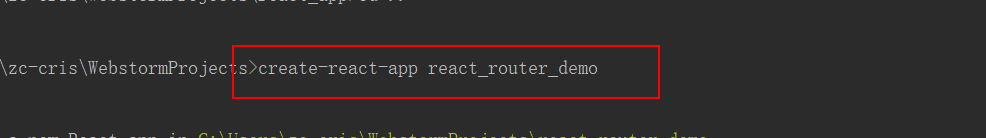

# React 学习日记


## 1. hello world

首先下载webstorm，然后激活（百度），最后导入React的三个基本依赖，书写一个hello world


页面显示如下：


## 2. jsx语法


测试页面


### 2.1 jsx语法实战：将一个数组里的内容通过jsx语法转换为列表格式


- 这里可能比较晦涩的一点是：react的jsx语法相当于融合和h5的标签以及js代码于一块，需要适应一下


## 3. React 面向组件编程

面向对象编程--》面向模块编程--》面向组件编程

### 3.1 关于React中面向组件编程的两种方式（工厂函数和继承类）


测试效果：


### 3.2 组件Component的三大属性：state

#### - 实战案例：根据用户点击动态切换文本

```react
<body>
<div id="test"></div>

<script type="text/javascript" src="../js/react.development.js"></script>
<script type="text/javascript" src="../js/react-dom.development.js"></script>
<script type="text/javascript" src="../js/babel.min.js"></script>

<script type="text/babel">
    /*
    自定义组件：显示h2 类型的文本：设置一个初始文本a；当我们点击这个文本的时候，显示另外的文件内容b，			根据点击动态变更文本内容
    */

    //1. 创建自定义的组件标签（推荐使用继承的方式，如果没有状态state，可以使用函数形式创建组件标签）
    class MyComponent extends React.Component {

        //一、初始化状态state（注意：state是一个对象）
        constructor(props) {
            super(props)
            this.state = {
                isOk: false
            }

            // 将新增的方法的this强制指向为组件对象(类似java中的装饰者模式，将handleClick函数重新装饰，我们点击事件绑定的函数
            // 其实是装饰后的新handleClick函数)
            this.handleClick = this.handleClick.bind(this)
        }

        // 我们自定义点击函数（默认this不是组件对象，而是undefined）
        handleClick() {
            console.log('handleClick()', this)
            // 得到状态并取反
            const isOk = !this.state.isOk
            // 三、更新状态(es6的新语法，根据对象的属性名直接赋值)
            this.setState({isOk})
        }

        // 重写组件类的方法
        render() {
            //二、读取状态值
            // const isOk = this.state.isOk
            const {isOk} = this.state           //结构赋值：es6的语法（对于后端开发人员确实有点怪异）
            return <h2 onClick={this.handleClick}>{isOk ? "你觉得ok吗？" : "我觉得还ok啊！"}</h2>
        }
    }

    ReactDOM.render(<MyComponent/>, document.getElementById("test"))

</script>
</body>
```


#### - 实战案例顺序：

1. 通过继承自定义我们的component标签
   - 在render方法里面定义h5标签，同时绑定监听事件（onClick），每次点击都会进行重绘（调用render方法）获取状态state对象的属性值，根据属性值的变换动态改变显示文本（三元运算符）
   - 注意在构造函数中将自定义的onClick函数的this改为当前的component对象
2. 渲染我们的component标签
3. 关于state的解析顺序：初始化state对象；读取state对象的状态值，根据这个状态值的不同进行组件渲染；写一个函数（例如点击函数）动态修改state对象的状态值；

#### - 总结：

1. 点击事件以及绑定的点击函数
2. 点击函数的binder装饰
3. jsx语法中{}还可以写三目运算符等进行判断

#### - 效果图：


### 3.3 组件Component的三大属性：props

#### - 实战案例：显示外界传来的数据并做限制

```react
<body>
<div id="test"></div>
<div id="test2"></div>

<script type="text/javascript" src="../js/react.development.js"></script>
<script type="text/javascript" src="../js/react-dom.development.js"></script>
<script type="text/javascript" src="../js/prop-types.js"></script>
<script type="text/javascript" src="../js/babel.min.js"></script>

<script type="text/babel">

    /*需求：
    * 1. 动态显示传入的参数的数据
    * 2. 对参数的数据进行默认值设置
    * 3. 对参数的数据类型做出限制
    * 3. 对参数的数据是否必要做出限制
    * */
    //1. 定义组件（函数的形式）
/*    function Person(props) {
        return (
        <ul>
            <li>{props.name}</li>
            <li>{props.age}</li>
            <li>{props.sex}</li>
        </ul>
        )
    }*/
    //1. 定义组件（对象继承的方式）
    class Person extends React.Component{

        render(){
            return (
                <ul>
                    <li>{this.props.name}</li>
                    <li>{this.props.age}</li>
                    <li>{this.props.sex}</li>
                </ul>
            )
        }
    }

    // 为组件标签设置props属性对象的键的数据格式和是否必须做出限制
    Person.propTypes = {
        name: PropTypes.string.isRequired,
        age: PropTypes.number.isRequired,
        sex: PropTypes.string
    }
    // 为组件标签的props对象设置默认的键值
    Person.defaultProps = {
        name: '老张',
        age: 19
    }

    const p1 = {
        name: 'cris',
        age:12,
        sex: '男'
    }
    const p2 = {
        sex: '女'
    }

    /*...符号的作用
    * 1.打包： function fn(...as) {} fn(1,2,3)     将1,2,3打包成数组as
    * 2.解包：const arr1 = [1,2,3] const arr2 = [4, ...arr1, 6]  将arr1解包成一个个参数放入到arr2中
    * */
    //2. 渲染组件
    //ReactDOM.render(<Person name={p1.name} age={p1.age} sex={p1.sex}/>, document.getElementById("test"))
    // es6 的语法糖（解包和装包符号  ...）通过{...p1}的格式将p1这个对象的键值对封装到Person这个自定义标签的props属性对象中
    // 关于语法糖：让程序员吃起来很甜的语法（简洁）；但是理解起来确实有点抽象；为了代码整洁，极简而定义的语法仁者见仁，智者见智（个人柑橘很厉害）
    ReactDOM.render(<Person {...p1}/>, document.getElementById("test"))
    ReactDOM.render(<Person {...p2}/>, document.getElementById("test2"))


</script>
</body>
```

#### - 测试


#### - 总结

1. 两种方式（函数和继承）将外界传来的参数封装为自定义标签的props属性对象
2. ... 符号的快速使用：解包和装包
3. 为自定义标签的props属性设置默认的键值对和对props属性的键值对的值做出类型和是否必要的限制

### 3.4 组件Component的三大属性：refs（以及事件对象event）

#### - 实战案例：点击按钮显示文本内容和文本框失去焦点事件

```react
<body>

<div id="test"></div>
<script type="text/javascript" src="../js/react.development.js"></script>
<script type="text/javascript" src="../js/react-dom.development.js"></script>
<script type="text/javascript" src="../js/prop-types.js"></script>
<script type="text/javascript" src="../js/babel.min.js"></script>

<!--实战案例：
    1. 自定义组件，点击按钮，输入第一个文本框中的已输入文本信息
    2. 当第二个文本框失去焦点的时候，提示这个文本框已输入的文本信息
-->
<script type="text/babel">
    class MyComponent extends React.Component{

        constructor(props){
            super(props)
            this.showInput = this.showInput.bind(this)
            this.handleBlur = this.handleBlur.bind(this)
        }

        showInput(){
            // 第一种写法：官方不推荐（虽然很简洁）
            const input = this.refs.content
            alert(input.value)
            //第二种写法：使用箭头函数
            alert(this.input.value)
        }

        handleBlur(event){
            alert(event.target.value) 
        }

        render(){
            return (
                <div>
                    {/*第一种写法：官方不推荐（虽然很简洁）*/}
                    <input type="text" ref="content"/>&nbsp;&nbsp;
                    {/*第二种写法：使用箭头函数，注意在render方法里面的注释很怪异*/}
                    <input type="text" ref={input => this.input = input}/>&nbsp;&nbsp;
                    <button onClick={this.showInput}>点击提示文本信息</button>&nbsp;&nbsp;

                    <input type="text"  placeholder="失去焦点提示文本信息" onBlur={this.handleBlur}/>
                </div>
            )
        }
    }

    ReactDOM.render(<MyComponent/>, document.getElementById("test"))
</script>
</body>
```

#### - 测试效果


#### - 总结

1. ref（refs）主要是用于自定义组件中的html标签的事件函数（例如点击事件绑定函数）对组件中的其他html标签做出修改操作
2. event 主要是用于自定义组件中的html标签的事件绑定函数对该html标签做出的改变操作


## 4. 综合案例实战（动态显示用户添加的列表数据）

### 4.1 实战要求

- 显示所有todo列表
- 输入文本, 点击按钮显示到列表的首位, 并清除输入的文本

### 4.2 开发步骤

1. 拆分组件: 拆分界面,抽取组件
2. 实现静态组件: 使用组件实现静态页面效果
3. 实现动态组件


### 4.3 分析显示数据的存放位置

我们需要思考，动态显示的页面数据到底应该放在哪个自定义的组件中？

如果只有一个组件需要这个数据，我们可以放在这一个组建中

如果有多个组件需要这个数据，建议方法他们公共的父组件中


### 4.4 开发流程

#### 1. 先将页面的效果静态显示出来

```react
<body>
<div id="test"></div>

<script type="text/javascript" src="../js/react.development.js"></script>
<script type="text/javascript" src="../js/react-dom.development.js"></script>
<script type="text/javascript" src="../js/prop-types.js"></script>
<script type="text/javascript" src="../js/babel.min.js"></script>

<script type="text/babel">

class App extends React.Component {

        render() {
            return (
                <div>
                    <h1>动态显示列表内容</h1>
                    <Content/>
                    <List/>
                </div>
            )
        }
    }

class Content extends React.Component {

        render(){
            return (
                <div>
                    <input type="text" />
                            <button>请点击以显示您添加的列表，add #3</button>
                </div>
            )
        }

    }

class List extends React.Component {

        render(){
            return (
                <div>
                    <ul>
                        <li>打球</li>
                        <li>看NBA</li>
                        <li>学习</li>
                    </ul>
                </div>

            )
        }
    }

    // 渲染组件标签
    ReactDOM.render(<App/>, document.getElementById("test"))
</script>
</body>
```

效果图：


#### 2. 完成显示数据的初始化

```react
    class App extends React.Component {

        constructor(props){
            super(props)
            this.state = {
                /*js中的数组创建方式*/
                toDoList: ['吃饭','睡觉','逛街']
            }
        }

        render() {
            {/*将重复的代码抽取出来*/}
            const {toDoList} = this.state
            return (
                <div>
                    <h1>动态显示列表内容</h1>
                    <Content count={toDoList.length}/>
                    {/*将初始化数据传递给子组件的props属性对象*/}
                    <List toDoList={toDoList}/>
                </div>
            )
        }
    }

    class Content extends React.Component {

        render(){
            return (
                <div>
                    <input type="text" />
                            <button>请点击以显示您添加的列表，add #{this.props.count +1}</button>
                </div>
            )
        }

    }
    Content.propTypes = {
        count: PropTypes.number.isRequired
    }

    class List extends React.Component {

        render(){
            {/*根据props属性对象的key进行结构赋值*/}
            const {toDoList} = this.props
            return (
                <div>
                    {/*js代码在React中一定要用{}包裹，操作数组中的数据一般都需要使用箭头函数*/}
                    {
                        toDoList.map((todo,index) => <li key={index}>{todo}</li>)
                    }
                    <ul>
                    </ul>
                </div>

            )
        }
    }
    /*子组件需要对从外界传入的数据做出限制*/
    List.propTypes = {
        toDoList: PropTypes.array.isRequired
    }
```

显示效果


#### 3. 完成动态效果

##### 3.1 注意：

哪个组件的状态state需要更新，那么这个更新函数就需要放在哪个组件中，本案例的父组件的state属性对象有一个数组属性，子组件需要动态更新这个数组，就需要调用父组件的更新函数

##### 3.2 代码

```react
    class App extends React.Component {

        constructor(props){
            super(props)
            this.state = {
                /*js中的数组创建方式*/
                toDoList: ['吃饭','睡觉','逛街']
            }
            // 自定义的方法需要修改this的指向
            this.addToDoList = this.addToDoList.bind(this)
        }

        /*父组件定义的state属性对象更新方法*/
        addToDoList(todo){
            const {toDoList} = this.state
            {/*将新添加的数据放入数组的第一个位置，记住：js中的数组的长度是可变的*/}
            toDoList.unshift(todo)
            {/*一定要使用setSate方法更新*/}
            this.setState({toDoList})
        }

        render() {
            {/*将重复的代码抽取出来*/}
            const {toDoList} = this.state
            return (
                <div>
                    <h1>动态显示列表内容</h1>
                    {/*不仅可以将父组件的state属性对象的属性传递给子组件，函数同理*/}
                    <Content count={toDoList.length} addToDoList={this.addToDoList}/>
                    {/*将初始化数据传递给子组件的props属性对象*/}
                    <List toDoList={toDoList}/>
                </div>
            )
        }
    }

    class Content extends React.Component {

        constructor(props){
            super(props)
            this.addToDoList = this.addToDoList.bind(this)
        }

        addToDoList(){
            //1. 读取输入的数据
            const value = this.inputToDo.value.trim()
            //2. 检查数据的合法性
            if (!value){
                alert("数据不能为空")
                return
            }
            //3. 调用父组件的函数进行数据的添加
            this.props.addToDoList(value)
            // 4. 清除用户输入数据
            this.inputToDo.value = ''
        }

        render(){
            return (
                <div>
                    {/*使用箭头函数将当前input标签赋值给组件的属性*/}
                    <input type="text" ref={(input) => (this.inputToDo = input)}/>
                            {/*自定义的函数绑定监听事件*/}
                            <button onClick={this.addToDoList}>请点击以显示您添加的列表，add #{this.props.count +1}</button>
                </div>
            )
        }

    }
    Content.propTypes = {
        count: PropTypes.number.isRequired,
        addToDoList: PropTypes.func.isRequired
    }
```

### 4.5 最终显示效果


### 4.6 组件化编程总结

1. 拆分组件
2. 实现静态组件（只有静态界面，没有动态数据和交互）
3. 实现动态组件
   1. 实现初始化数据动态显示（初始化数据到底放在哪个组件？这个问题很重要，涉及到初始化数据的更新函数的开发位置)
   2. 实现交互功能（事件监听函数的实现）


## 5. 收集表单数据（受控组件和非受控组件两种方式）

### 5.1 代码

```react
<div id="test"></div>

<script type="text/javascript" src="../js/react.development.js"></script>
<script type="text/javascript" src="../js/react-dom.development.js"></script>
<script type="text/javascript" src="../js/prop-types.js"></script>
<script type="text/javascript" src="../js/babel.min.js"></script>

<script type="text/babel">

    /*案例要求：用户输入用户名和密码后，点击提交按钮，界面阻止提交动作并弹窗用户输入的内容*/
    class LoginForm extends React.Component {

        constructor(props){
            super(props)
            /*第二种方法：受控组件*/
            this.state = {
                pwd: ''
            }
            // 自定义的函数一定首先要改变this的指向
            this.handleSubmit = this.handleSubmit.bind(this)
            this.handleChange = this.handleChange.bind(this)
        }

        /*第一种方法：非受控组件*/
        handleSubmit(event){
            const nameInput = this.nameInput.value
            const {pwd} = this.state
            /*注意：这里使用了模板输入语句，可以直接输出变量内容（${变量名}），类似于java中lomback的@Slf4j的作用*/
            alert(`用户输入的用户名为：${nameInput},输入的密码为：${pwd}`)
            // alert(nameInput)
            // 阻止表单的默认提交事件
            event.preventDefault()
        }
        /*第二种方法：受控组件*/
        handleChange(event){
            // 拿到当前发生事件的组件(target)的值
            const pwd = event.target.value
            // 更新到自定义标签类的初始化state中去
            this.setState({pwd})
        }

        render (){
            return (
                <form action="login" onSubmit={this.handleSubmit}>
                    用户名：<input type="text" ref={input => this.nameInput = input}/>
                    密码：<input type="password" value={this.state.pwd} onChange={this.handleChange}/>
                    <input type="submit"/>
                </form>
            )
        }
    }

    ReactDOM.render(<LoginForm/>, document.getElementById("test"))

</script>
</body>
```

### 5.2 实现效果


### 5.3 关于受控组件和非受控组件

都是包含表单数据的组件，但是

受控组件：表单项输入数据能够自动收集成状态state（上面的密码输入框为例）

非受控组件：需要时才手动读取表单输入框的数据（上面的用户名输入框为例）


## 6. 组件生命周期

### 6.1 实战案例：完成渐变动画效果（定时器）以及自定义组件的销毁（组件的生命周期）

    1. 让指定的文本做显示/隐藏的渐变动画
    
    2. 切换持续时间为2S
    
    3. 点击按钮从界面中移除组件界面

```react
<body>
<div id="test"></div>
<script type="text/javascript" src="../js/react.development.js"></script>
<script type="text/javascript" src="../js/react-dom.development.js"></script>
<script type="text/javascript" src="../js/prop-types.js"></script>
<script type="text/javascript" src="../js/babel.min.js"></script>
<script type="text/babel">
    class MyConponent extends React.Component{
        constructor(props){
            super(props)
            this.state = {
                opacity:1
            }
            this.destroyComponenet = this.destroyComponenet.bind(this)
        }
        /*
        自定义组件的生命周期方法，用于定义该组件已经挂载完毕之后执行的方法，即render方法渲染后
        */
        componentDidMount(){
            /*这里是启动一个循环定时器，用于不停的重复变换文本内容的透明度*/
            this.intervalId = setInterval(function () {
                console.log("定时器在执行...")
                /*注意这里不能使用const，因为要每隔200毫秒减少组件的透明度，所以使用let关键字*/
                let {opacity} = this.state
                opacity -= 0.1
                if (opacity <= 0){
                    opacity = 1
                }
                this.setState({opacity})
            }.bind(this),200)                       //setInterval回调函数默认this是window对象，所以需要更换this指向；React的组件生命周期函数中的this默认指向当前组件对象
        }

        /*点击按钮执行自定义组件的销毁流程*/
        destroyComponenet(){
            // 调用React的方法来销毁组件
            ReactDOM.unmountComponentAtNode(document.getElementById("test"))
        }

        /*销毁组件之前需要进行的操作（销毁定时器，防止内存泄漏（很重要））*/
        componentWillUnmount(){
            // 清理定时器
            clearInterval(this.intervalId)
        }

        render(){
            const {opacity} = this.state
            return (
                <div>
                <h2 style={{opacity: opacity}}>{this.props.msg}</h2>
                <button onClick={this.destroyComponenet}>不想学了啊</button>
                </div>
            )
        }
    }
    /*渲染自定义组件时传入的属性自动封装到props属性中*/
    ReactDOM.render(<MyConponent msg="React好难啊！"/>, document.getElementById("test"))

</script>
</body>
```

### 6.2 实战效果


### 6.3 生命周期流程图


### 6.4 生命周期流程图详解


### 6.5 重要的钩子函数


## 7. 虚拟DOM和DOM Diff算法

### 7.1 实战案例：实时显示当前时间（定时器）

```react
<body>
<div id="test"></div>
<script type="text/javascript" src="../js/react.development.js"></script>
<script type="text/javascript" src="../js/react-dom.development.js"></script>
<script type="text/javascript" src="../js/prop-types.js"></script>
<script type="text/javascript" src="../js/babel.min.js"></script>
<script type="text/babel">
    class MyComponent extends React.Component{

        constructor(props){
            super(props)
            this.state = {
                date: new Date()
            }
        }

        componentDidMount(){
            // 箭头函数替代普通的回调函数，非常方便的将函数内的this指向当前对象
            setInterval(() =>{
                /*let {date} = this.state
                date = new Date()
                this.setState({date})*/
                this.setState({
                    date: new Date()
                })
            },1000)
        }

        render (){
            return (
                <div>
                    <h3>请输入你的名字</h3>
                    <input type="test" placeholder="输入内容不会影响其他部分"/>
                    <span>
                        现在当地时间是：{this.state.date.toLocaleTimeString()}
                    </span>
                </div>
            )
        }
    }

    ReactDOM.render(<MyComponent/>, document.getElementById("test"))
</script>
</body>
```

### 7.2 效果展示


### 7.3 关于React 虚拟DOM为什么可以提高效率？

- 首先，React 的jsx语法上手比较有成本，但是一旦掌握，对于开发者的开发效率将会大大提升（因为我们不在操纵原生DOM对象，转而操作React 的虚拟DOM对象，相当于架起来一座桥梁）
- React 虚拟DOM的DOM Diff算法可以根据我们修改的虚拟DOM部分，去修改原生DOM的相关部分，不需要像以前那样全部重新渲染，开发人员只需要关注开发虚拟DOM变化的部分，渲染的部分交给DOM Diff算法，大大提高了渲染效率和开发效率

### 7.4 虚拟DOM Diff算法原理图


##  8. react 脚手架开发react 应用

### 8.1 下载react 脚手架


### 8.2 创建一个react应用


### 8.3 初步开发我们自己的react 应用（极度重点）

#### 1. 首先使用webstorm 打开我们刚创建好的react应用


#### 2. 开发我们自己的组件


#### 3. index.js 引入我们的组件


#### 4. 控制台启动


#### 5. 效果展示


#### 6. 自定义css


效果图：


## 9. 评论demo实战练习

### 9.1 组件拆分和静态效果展示

#### 1. 结构图


#### 2. 引入全局bootstrap 样式


#### 3. 主组件app.jsx

```react
import React, {Component} from 'react'

/*导入我们拆分出来的自定义标签*/
import CommentAdd from '../comment-add/comment-add'
import CommentList from '../comment-list/comment-list'

export default class  App extends Component {

    render () {
        return (
            <div>
                <header className="site-header jumbotron">
                    <div className="container">
                        <div className="row">
                            <div className="col-xs-12">
                                <h1>请发表对React的评论</h1>
                            </div>
                        </div>
                    </div>
                </header>
                <div className="container">
                    <CommentAdd/>
                    <CommentList/>
                </div>
            </div>
        )
    }
}
```


#### 4. 拆分的子组件

- 评论添加组件 comment-add.jsx

```react
import React, {Component} from 'react'

export default class CommentAdd extends Component {

    render () {
        return (
            <div className="col-md-4">
                <form className="form-horizontal">
                    <div className="form-group">
                        <label>用户名</label>
                        <input type="text" className="form-control" placeholder="用户名" />
                    </div>
                    <div className="form-group">
                        <label>评论内容</label>
                        <textarea className="form-control" rows="6" placeholder="评论内容"></textarea>
                    </div>
                    <div className="form-group">
                        <div className="col-sm-offset-2 col-sm-10">
                            <button type="button" className="btn btn-default pull-right">提交</button>
                        </div>
                    </div>
                </form>
            </div>
        )
    }
}
```

- 评论显示组件 comment-list.jsx

```react
import React, {Component} from 'react'
import './commentList.css'      /*导入css样式*/

export default class CommentList extends Component {

    render () {
        return (
            <div className="col-md-8">
                <h3 className="reply">评论回复：</h3>
                <h2 style={{display: 'none'}}>暂无评论，点击左侧添加评论！！！</h2>
                <ul className="list-group">
                    <li className="list-group-item">
                        <div className="handle">
                            <a href="javascript:;">删除</a>
                        </div>
                        <p className="user"><span>xxx</span><span>说:</span></p>
                        <p className="centence">React不错!</p>
                    </li>
                    <li className="list-group-item">
                        <div className="handle">
                            <a href="javascript:;">删除</a>
                        </div>
                        <p className="user"><span>yyy</span><span>说:</span></p>
                        <p className="centence">React有点难!</p>
                    </li>
                </ul>
            </div>
        )
    }
}
```

- 评论显示组件的css样式表 commentList.css

```scss
.reply {
    margin-top: 0px;
}

li {
    transition: .5s;
    overflow: hidden;
}

.handle {
    width: 40px;
    border: 1px solid #ccc;
    background: #fff;
    position: absolute;
    right: 10px;
    top: 1px;
    text-align: center;
}

.handle a {
    display: block;
    text-decoration: none;
}

.list-group-item .centence {
    padding: 0px 50px;
}

.user {
    font-size: 22px;
}
```


#### 5. 效果图

控制台启动：npm start


### 9.2 评论初始化及其动态显示

- 评论列表需要设计成数组，那么这个数组是放在哪个组件里面呢？是放在comment-add.jsx还是comment-list.jsx 中呢？我们这里选择放在父组件 app.jsx 中，因为这个数组将会在两个子组件中都会使用到，公共的部分我们都放在父组件中，而且需要初始化（放入到state属性中）

#### 1. 父组件改造


#### 2. 显示列表组件改造

- 引入PropTypes 规则包

  


  


- comment-list.jsx

```react
import React, {Component} from 'react'
import PropTypes from 'prop-types'      // 如果要对外界传来的数据做出显示，需要导入这个规则包

// 引入显示列表每个item的组件
import CommentItem from '../comment-item/comment-item'
import './commentList.css'      /*导入css样式*/

export default class CommentList extends Component {

    /*给组件类添加props属性验证规则,现在的做法更加简洁*/
    static propTypes = {
        comments: PropTypes.array.isRequired
    }

    render () {

        const {comments} = this.props

        return (
            <div className="col-md-8">
                <h3 className="reply">评论回复：</h3>
                <h2 style={{display: 'none'}}>暂无评论，点击左侧添加评论！！！</h2>
                <ul className="list-group">
                    {
                        comments.map((comment, index) => <CommentItem comment={comment} key={index}/>)
                    }
                </ul>
            </div>
        )
    }
}
/*对外界传入的参数需要做出验证,这是我们以前的做法*/
/*
CommentList.propTypes = {
    comments: PropTypes.array.isRequired
}
*/
```


 

#### 3. 评论项改造

- commentItem.css

```css
li {
    transition: .5s;
    overflow: hidden;
}

.handle {
    width: 40px;
    border: 1px solid #ccc;
    background: #fff;
    position: absolute;
    right: 10px;
    top: 1px;
    text-align: center;
}

.handle a {
    display: block;
    text-decoration: none;
}

.list-group-item .centence {
    padding: 0px 50px;
}

.user {
    font-size: 22px;
}
```

- comment-item.jsx

```react
import React, {Component} from 'react'
import PropTypes from 'prop-types'

import './commentItem.css'

export default class CommentItem extends Component {

    /*传入的必须是一个js对象，用于显示每条评论*/
    static propTypes = {
        comment: PropTypes.object.isRequired
    }

    render () {

        const {comment} = this.props

        return (
            <li className="list-group-item">
                <div className="handle">
                    <a href="javascript:;">删除</a>
                </div>
                <p className="user"><span>{comment.username}</span><span>说:</span></p>
                <p className="centence">{comment.content}</p>
            </li>
        )
    }
}
```


#### 4. 动态显示效果图


### 9.3 评论添加

#### 1. 改造App.jsx


#### 2. 改造comment-add.jsx

```react
export default class CommentAdd extends Component {

    static propTypes = {
        addComment: PropTypes.func.isRequired
    }

    /*这样初始化state属性而不是使用constructor构造函数，更加简洁*/
    state = {
        username: '',
        content: ''
    }

    /*使用箭头函数的形式生成提交用户评论的函数，因为箭头函数默认this指向的是当前对象*/
    handleSubmit = () => {

        // 收集用户名和用户评论（推荐使用受控组件的方式：即使用对象的state属性来初始化，封装数据，而且很方便的就可以清除用户输入的数据）
        // 封装成comment 对象(必须要注意comment对象的属性和state的属性名必须一致)
        const comment = this.state

        // 提交用户名和评论（实际上是调用父组件的添加方法，因为数组是在父组件中）
        this.props.addComment(comment)

        //清除输入的数据
        this.setState({
            username: '',
            content: ''
        })

    }

    handleUsernameChange = (event) => {
        /*拿到输入框的用户名，然后设置到state属性中去*/
        const username = event.target.value
        this.setState({username})
    }

    handleContentChange = (event) => {
        const content = event.target.value
        this.setState({content})
    }

    render () {
        /*先获取到state属性中的key对应的value*/
        const {username, content} = this.state

        return (
            <div className="col-md-4">
                <form className="form-horizontal">
                    <div className="form-group">
                        <label>用户名</label>
                        <input type="text" className="form-control" placeholder="用户名" value={username}
                               onChange={this.handleUsernameChange}/>
                    </div>
                    <div className="form-group">
                        <label>评论内容</label>
                        <textarea className="form-control" rows="6" placeholder="评论内容" value={content}
                                  onChange={this.handleContentChange}></textarea>
                    </div>
                    <div className="form-group">
                        <div className="col-sm-offset-2 col-sm-10">
                            <button type="button" className="btn btn-default pull-right" onClick={this.handleSubmit}>提交</button>
                        </div>
                    </div>
                </form>
            </div>
        )
    }
}
```


#### 3. 完成效果


### 9.4 评论删除

#### 1. APP 定义删除评论的方法并传递给 CommentList

```react
    /*父组件删除评论的方法*/
    deleteComment = (index) => {
        const {comments} = this.state
        // slice 方法可以用于数组的新增，删除和修改
        // comments.splice(index, 1, {})     指定index 位置替换一个数据
        // comments.splice(index, 0, {})     指定index 位置添加一个数据
        comments.splice(index, 1)          //指定index 位置删除一个数据
        // 一定要更新父组件的state属性，添加comment到comments 数组的行为才可以生效
        this.setState({comments})
    }
    
    render () {

      const {comments} = this.state

      return (
        <div>
          <header className="site-header jumbotron">
            <div className="container">
              <div className="row">
                <div className="col-xs-12">
                  <h1>请发表对React的评论</h1>
                </div>
              </div>
            </div>
          </header>
          <div className="container">
            <CommentAdd addComment={this.addComment}/>
            {/*这里选择将父组件的deleteComment方法通过CommentList 传递给CommentItem */}
            <CommentList comments = {comments} deleteComment = {this.deleteComment}/>
          </div>
        </div>
      )
    }
```


#### 2. 完善 CommentList（传递deleteComment 函数和做文本显示判断）

```react
import React, {Component} from 'react'
import PropTypes from 'prop-types'      // 如果要对外界传来的数据做出显示，需要导入这个规则包

// 引入显示列表每个item的组件
import CommentItem from '../comment-item/comment-item'
import './commentList.css'      /*导入css样式*/

export default class CommentList extends Component {

    /*给组件类添加props属性验证规则*/
    static propTypes = {
        comments: PropTypes.array.isRequired,
        deleteComment: PropTypes.func.isRequired
    }

    render () {

        const {comments, deleteComment} = this.props
        // 定义一个常量，计算评论列表是否需要显示暂无评论的文本（）
        /* == 和 != 比较若类型不同，先偿试转换类型，再作值比较，最后返回值比较结果 。而 === 和 !== 只有在相同类型下,才会比较其值，建议使用 === */
        const display = comments.length === 0 ? 'block' : 'none'

        return (
            <div className="col-md-8">
                <h3 className="reply">评论回复：</h3>
                {/*这里style的属性使用结构赋值的es6 语法*/}
                <h2 style={{display}}>暂无评论，点击左侧添加评论！！！</h2>
                <ul className="list-group">
                    {
                        /*这里将父组件的deleteComment 方法传递给 CommentItem 子组件，CommentList 充当了中间桥梁的作用，还需要传递index（数组索引给 CommentItem ）*/
                        comments.map((comment, index) => <CommentItem comment={comment} key={index} index={index} deleteComment={deleteComment}/>)
                    }
                </ul>
            </div>
        )
    }
}
```


#### 3. CommentItem 的删除事件

```react
import React, {Component} from 'react'
import PropTypes from 'prop-types'

import './commentItem.css'

export default class CommentItem extends Component {

    /*传入的必须是一个js对象，用于显示每条评论*/
    static propTypes = {
        comment: PropTypes.object.isRequired,
        index: PropTypes.number.isRequired,
        deleteComment: PropTypes.func.isRequired
    }

    /*用户点击删除按钮事件*/
    handleClick = () => {
        const {index, deleteComment, comment} = this.props
        /*这里使用变量输出语法，记得使用 `xxx` 符号而不是 'xxx'*/
        if (window.confirm(`确认要删除${comment.username}的评论吗？`)) {
            // 用户确认后删除用户评论数据
            deleteComment(index)
        }
    }

    render () {

        const {comment} = this.props

        return (
            <li className="list-group-item">
                <div className="handle">
                    <a href="javascript:;" onClick={this.handleClick}>删除</a>
                </div>
                <p className="user"><span>{comment.username}</span><span>说:</span></p>
                <p className="centence">{comment.content}</p>
            </li>
        )
    }
}
```


#### 4. 最终显示效果


## 10. react通过 axios 完成ajax交互

### 10.1 实战案例：通过axios 调用github 官方接口得到数据并显示

```react
<body>
<div id="test"></div>
<script type="text/javascript" src="../js/react.development.js"></script>
<script type="text/javascript" src="../js/react-dom.development.js"></script>
<script type="text/javascript" src="../js/prop-types.js"></script>
<!--方便测试引入 cdn -->
<script src="https://cdn.bootcss.com/axios/0.17.1/axios.js"></script>
<script type="text/javascript" src="../js/babel.min.js"></script>
<script type="text/babel">
    /*
    * 需求：根据指定的关键字在 github 上搜索匹配的最受关注的库，显示库名，以超链接的形式展现，点击即可跳转到这个库的 github 首页去
    *       测试接口：http://api.github.com/search/repositories?q=rea&sort=stars
    */
    class TestAxiosComponent extends React.Component {

        /*将ajax请求返回的数据放入到组件的state属性对象中*/
        state = {
            repoName: '',
            repoUrl: ''
        }

        /*异步发送ajax 请求一般都放在这个生命周期方法里面*/
        componentDidMount() {
            const url = 'http://api.github.com/search/repositories?q=rea&sort=stars'
            // 使用 axios 协助发送异步的 ajax 请求
            axios.get(url)
                // .post(url, {})       // 这是post 请求
                .then(response => {
                    const result = response.data
                    // console.log(response)
                    // 获取到远程返回数据的指定值(第一个仓库的name 和 html地址)
                    const {html_url, name} = result.items[0]
                    //然后更新到我们组件的state 属性对象中去
                    this.setState({
                        repoName: name,
                        repoUrl: html_url
                    })
                })
        }

        render() {
            const {repoName, repoUrl} = this.state
            //如果没有通过ajax 请求异步获取到值
            if (!repoName) {
                return <h2>Loading...</h2>
            } else {
                // 如果获取到值了
                return <h2>The most start repository is <a href={repoUrl}>{repoName}</a></h2>
            }
        }
    }

    ReactDOM.render(<TestAxiosComponent/>, document.getElementById("test"))
</script>
</body>
```


### 10.2 显示效果


## 11. 利用ajax 请求完成giuhub 用户搜索案例实战

### 11.1 搭建环境


- index.js

```js
import React from 'react'
import ReactDOM from 'react-dom'

import App from './components/app'
import './index.css'

ReactDOM.render(<App/>, document.getElementById('root'))
```

- app.jsx

```react
import React, {Component} from 'react'

import Search from './search'
import Main from './main'

export default class App extends Component {

    render () {
        return (
            <div className="container">
                <Search/>
                <Main/>
            </div>
        )
    }
}
```

- main.jsx

```react
import React, {Component} from 'react'

export default class Main extends Component {

    render () {
        return (
            <div className="row">
                <div className="card">
                    <a href="https://github.com/reactjs" target="_blank">
                        
                    </a>
                    <p className="card-text">reactjs</p>
                </div>
            </div>
        )
    }
}
```

- search.jsx

```react
import React, {Component} from 'react'

export default class Search extends Component {

    render () {
        return (
            <section className="jumbotron">
                <h3 className="jumbotron-heading">Search Github Users</h3>
                <div>
                    <input type="text" placeholder="enter the name you search"/>
                    <button>Search</button>
                </div>
            </section>
        )
    }
}
```

- index.css 略


### 11.2 静态效果图

- npm start 启动react 应用


### 11.3 main.js（用户数据展示组件的初始化）

```react
import React, {Component} from 'react'

export default class Main extends Component {

    state = {
        initView: true,             // 初始化状态
        loading: false,             // 发送请求的loading状态
        users: null,                // 获取到用户数据的状态，即成功状态
        errorMsg: null              // 获取用户数据失败的状态
    }

    /*需要根据状态来进行组件的渲染*/
    render () {

        const {initView, loading, users, errorMsg} = this.state
        if (initView){
            return <h2>请输入用户名进行检索</h2>
        } else if (loading){
            return <h2>正在检索中...请稍后</h2>
        } else if (errorMsg){
            return <h2>{errorMsg}</h2>
        } else {
            return (
                users.map((user, index) => (               // 箭头函数不仅可以绑定this 到当前对象，还可以省略 return 关键字
                    <div className="row">
                        <div className="card">
                            <a href={user.url} target="_blank">
                                
                            </a>
                            <p className="card-text">{user.name}</p>
                        </div>
                    </div>
                ))
            )
        }
    }
}
```

- 效果图


### 11.4 用户交互（极度重点）

#### 1. 用户交互分析


#### 2. App.jsx

```react
import React, {Component} from 'react'

import Search from './search'
import Main from './main'

export default class App extends Component {

    state = {
        searchName: ''
    }
    
    /*父组件的state 属性对象作为中间参数，获取Search 组件用户输入的数据然后传递到Main 组件中去*/
    setSearchName = (searchName) => {
        this.setState({searchName})
    }

    render () {
        return (
            <div className="container">
                <Search setSearchName={this.setSearchName}/>   {/*将父组件的函数设置给子组件用于更新父组件的state 属性的searchName 值*/}
                <Main searchName = {this.state.searchName}/>
            </div>
        )
    }
}
```

#### 3. Search.jsx

```react
import React, {Component} from 'react'
import PropTypes from 'prop-types'

export default class Search extends Component {

    static propTypes = {
        setSearchName: PropTypes.func.isRequired
    }

    state = {
        input: ''
    }

    handleClick = () => {
        // 获取用户输入的搜索数据（非受控组件的形式）
        const searchName = this.input.value.trim()
        // const searchName = this.state.input          // 受控组件的形式

        if (searchName){
            // 调用父组件的搜索数据设置方法
            this.props.setSearchName(searchName)
        } else {
            alert("请输入搜索的用户名")
        }
    }

    // 如果使用受控组件就稍微麻烦一些
    handleChange = (event) =>{
        const input = event.target.value.trim()
        this.setState({input})
    }

    render () {
        return (
            <section className="jumbotron">
                <h3 className="jumbotron-heading">Search Github Users</h3>
                <div>
                    {/*这里使用非受控组件进行数据的获取*/}
                    <input type="text" placeholder="enter the name you search" ref={input => this.input = input}/>

                    {/*如果使用非受控组件就比较好清除输入框的内容，但是要麻烦一些（虽然官方推荐）*/}
                    {/*<input type="text" placeholder="enter the name you search" value={this.state.input} onChange={this.handleChange}/>*/}

                    <button onClick={this.handleClick}>Search</button>
                </div>
            </section>
        )
    }
}
```

#### 4. Main.jsx

```react
import React, {Component} from 'react'
import PropTypes from 'prop-types'
import axios from 'axios'       // 导入axios 包

export default class Main extends Component {

    static propTypes = {
        searchName: PropTypes.string
    }

    state = {
        initView: true,             // 初始化状态
        loading: false,             // 发送请求的loading状态
        users: null,                // 获取到用户数据的状态，即成功状态
        errorMsg: null              // 获取用户数据失败的状态
    }

    /*每次外界传入到组件的props 属性对象的值变化的时候就回调*/
    componentWillReceiveProps(newProps) {
        const {searchName} = newProps

        // 更新状态为请求中
        this.setState({
            initView: false,            // 必须先设置初始化状态为false
            loading: true
        })

        //发送ajax 请求
        const url = `https://api.github.com/search/users?q=${searchName}`       // 使用命名参数语法需要`xxx${yyy}`， 不要使用'xxx'x或者 "xxx"
        axios.get(url)
            .then(response => {
                // 得到响应数据
                const result = response.data
                // 这里非常类似java 8 中的Steam API，都是将一个数组的数据转换为另一种格式数据的数组
                const users = result.items.map(item => ({
                    name: item.login,
                    url: item.html_url,
                    avatarUrl: item.avatar_url
                }))
                // 将状态改为成功（即获取到远程服务器的数据）
                this.setState({loading: false, users})
            })
            .catch(error => {
                // 将状态改为失败
                this.setState({loading: false, errorMsg: error.message})
            })
    }

    /*需要根据状态来进行组件的渲染*/
    render() {
        console.log(this.props.searchName)
        const {initView, loading, users, errorMsg} = this.state
        if (initView) {
            return <h2>请输入用户名进行检索</h2>
        } else if (loading) {
            return <h2>正在检索中...请稍后</h2>
        } else if (errorMsg) {
            return <h2>{errorMsg}</h2>
        } else {
            return (
                <div className="row">
                    {
                        users.map((user, index) => ( 
                          // 箭头函数不仅可以绑定this 到当前对象，还可以省略 return 关键字：需要函数体在（）中
                            <div className="card" key={index}>
                                <a href={user.url} target="_blank">
                                    
                                </a>
                                <p className="card-text">{user.name}</p>
                            </div>

                        ))
                    }
                </div>
            )
        }
    }
}
```


### 11.5 最终效果图


## 12. 组件通信总结（绝对重点）

### 12.1 通过props 通信的机制（今后开发不建议使用这种方式）

1)	共同的数据放在父组件上, 特有的数据放在自己组件内部(state)

2)      通过props可以传递一般数据和函数数据, 只能一层一层传递

3)      一般数据-->父组件传递数据给子组件-->子组件读取数据

4)      函数数据-->子组件传递数据给父组件-->子组件调用函数


### 12.2 通过发布-订阅通信的机制

1)      工具库:PubSubJS

2)      下载: npminstall pubsub-js --save

3)      使用: 

​          import PubSub from 'pubsub-js' //引入

​          PubSub.subscribe('delete', function(data){ }); //订阅

​          PubSub.publish('delete', data) //发布消息


### 12.3 使用pub-sub 机制改造上面的github 用户搜索案例

- 下载pubsub-js


- 代码改进（App.jsx）

```react
import React, {Component} from 'react'

import Search from './search'
import Main from './main'

export default class App extends Component {

    render() {
        return (
            <div className="container">
                <Search/>
                <Main/>
            </div>
        )
    }
}
```

- 代码改进（search.jsx）

```react
import React, {Component} from 'react'
import PubSub from 'pubsub-js'      // 引入pubsub-js 这个发布订阅包

export default class Search extends Component {


    state = {
        input: ''
    }

    handleClick = () => {
        // 获取用户输入的搜索数据（非受控组件的形式）
        const searchName = this.input.value.trim()
        // const searchName = this.state.input          // 受控组件的形式

        if (searchName) {
            // 需要发布消息（消息名和消息参数）
            PubSub.publish('search_user_name', searchName)
        } else {
            alert("请输入搜索的用户名")
        }
    }

    // 如果使用受控组件就稍微麻烦一些
    handleChange = (event) => {
        const input = event.target.value.trim()
        this.setState({input})
    }

    render() {
        return (
            <section className="jumbotron">
                <h3 className="jumbotron-heading">Search Github Users</h3>
                <div>
                    {/*这里使用非受控组件进行数据的获取*/}
                    <input type="text" placeholder="enter the name you search" ref={input => this.input = input}/>

                    {/*如果使用非受控组件就比较好清除输入框的内容，但是要麻烦一些（虽然官方推荐）*/}
                    {/*<input type="text" placeholder="enter the name you search" value={this.state.input} onChange={this.handleChange}/>*/}

                    <button onClick={this.handleClick}>Search</button>
                </div>
            </section>
        )
    }
}
```

- 代码改进（main.jsx）

```react
import React, {Component} from 'react'
import axios from 'axios' // 导入axios 包
import PubSub from 'pubsub-js'

export default class Main extends Component {


    state = {
        initView: true,             // 初始化状态
        loading: false,             // 发送请求的loading状态
        users: null,                // 获取到用户数据的状态，即成功状态
        errorMsg: null              // 获取用户数据失败的状态
    }

    /*注意：订阅事件需要在组件初始化完成后即绑定*/
    componentDidMount() {

        /*强烈建议回调函数都用箭头的形式*/
        PubSub.subscribe('search_user_name', (msg, searchName) => {
            // 更新状态为请求中
            this.setState({
                initView: false,            // 必须先设置初始化状态为false
                loading: true
            })

            //发送ajax 请求
            const url = `https://api.github.com/search/users?q=${searchName}`       // 使用命名参数语法需要`xxx${yyy}`， 不要使用'xxx'x或者 "xxx"
            axios.get(url)
                .then(response => {
                    // 得到响应数据
                    const result = response.data
                    // 这里非常类似java 8 中的Steam API，都是将一个数组的数据转换为另一种格式数据的数组
                    const users = result.items.map(item => ({
                        name: item.login,
                        url: item.html_url,
                        avatarUrl: item.avatar_url
                    }))
                    // 将状态改为成功（即获取到远程服务器的数据）
                    this.setState({loading: false, users})
                })
                .catch(error => {
                    // 将状态改为失败
                    this.setState({loading: false, errorMsg: error.message})
                })
        })
    }

    /*需要根据状态来进行组件的渲染*/
    render() {
        console.log(this.props.searchName)
        const {initView, loading, users, errorMsg} = this.state
        if (initView) {
            return <h2>请输入用户名进行检索</h2>
        } else if (loading) {
            return <h2>正在检索中...请稍后</h2>
        } else if (errorMsg) {
            return <h2>{errorMsg}</h2>
        } else {
            return (
                <div className="row">
                    {
                        users.map((user, index) => ( // 箭头函数不仅可以绑定this 到当前对象，还可以省略 return 关键字：需要函数体在（）中

                            <div className="card" key={index}>
                                <a href={user.url} target="_blank">
                                    
                                </a>
                                <p className="card-text">{user.name}</p>
                            </div>

                        ))
                    }
                </div>
            )
        }
    }
}
```

- 改进效果


### 12.4 什么时候使用pub-sub 模式？

当我们的组件和组件之间传递的参数层级大于或者等于3的时候，就需要考虑使用pub-sub模式

以用户评论管理案例为例：

1. 评论添加不需要使用pub-sub模式，因为comment-add组件添加完成后之间调用父组件的添加方法（这里层级是2）
2. 但是评论删除功能，需要父组件的删除方法-->comment-list组件-->comment-item组件（这里层级是3），所以建议使用发布-订阅模式，comment-item组件不再调用传递来的父组件的删除方法，而是发布删除消息，父组件接收到后直接调用自己的删除函数即可


### 12.5 使用pub-sub 模式改进用户评论管理案例

1. comment-item.jsx

```react
    /*用户点击删除按钮事件*/
    handleClick = () => {
        const {index, comment} = this.props
        /*这里使用变量输出语法，记得使用 `xxx` 符号而不是 'xxx'*/
        if (window.confirm(`确认要删除${comment.username}的评论吗？`)) {
           /*用户确定删除那么就需要发布删除事件给App父组件*/
            // 这里的两个参数：发布事件名，父组件删除item函数需要的index索引
            PubSub.publish('delete_comment', index)
        }
    }
```

2. App.jsx

```react
    /*订阅事件一般都放在组件初始化完成后*/
    componentDidMount(){
        PubSub.subscribe('delete_comment', (msg, index) => {
            this.deleteComment(index)
        })
    }
```

3. 效果图


## 13. React-router

### 13.1 react-router的理解

1)      react的一个插件库

2)      专门用来实现一个SPA应用

3）     基于react的项目基本都会用到此库


### 13.2 SPA的理解

1) 单页Web应用（single page web application，SPA）

2) 整个应用只有一个完整的页面

3) 点击页面中的链接不会刷新页面, 本身也不会向服务器发请求

4) 当点击路由链接时, 只会做页面的局部更新

5) 数据都需要通过ajax请求获取, 并在前端异步展现


### 13.3 路由的理解

1) 什么是路由?
a.一个路由就是一个映射关系(key:value)
b.key为路由路径, value可能是function/component

2)路由分类
a.后台路由: node服务器端路由, value是function, 用来处理客户端提交的请求并返回一个响应数据
b.前台路由: 浏览器端路由, value是component, 当请求的是路由path时, 浏览器端前没有发送http请求, 但界面会更新显示对应的组件 

3)后台路由
a.注册路由: router.get(path, function(req, res))
b.当node接收到一个请求时, 根据请求路径找到匹配的路由, 调用路由中的函数来处理请求, 返回响应数据

4)前端路由
a.注册路由: <Route path="/about" component={About}>
b.当浏览器的hash变为#about时, 当前路由组件就会变为About组件


### 13.4 实战案例：根据用户点击显示不同的路由组件

#### 1. 快速搭建一个react 应用




#### 2. 安装react-router 插件


#### 3. 引入bootstrap.css


#### 4. 完成各个组件

- index.jsx

```react
import React from 'react'
import {render} from 'react-dom'
import {BrowserRouter} from 'react-router-dom'

import App from './component/App'

render(
    (
        /*使用BrowserRouter 来管理我们的应用*/
        <BrowserRouter>
            <App/>
        </BrowserRouter>
    ),
    document.getElementById("root")
)
```

- home.jsx

```react
import React, {Component} from 'react'

export default class Home extends Component {

    render () {
        return (
            <div>
                home route component
            </div>
        )
    }
}
```

- about.jsx

```react
import React, {Component} from 'react'

export default class About extends Component {

    render () {
        return (
            <div>
                about route component
            </div>
        )
    }
}
```

- app.jsx

```react
import React, {Component} from 'react'
import {NavLink, Switch, Route, Redirect} from 'react-router-dom'

import About from '../view/about'
import Home from '../view/home'

export default class App extends Component {
    render() {
        return (
            <div>
                <div className="row">
                    <div className="col-xs-offset-2 col-xs-8">
                        <div className="page-header"><h2>React Router Demo</h2></div>
                    </div>
                </div>

                <div className="row">
                    <div className="col-xs-2 col-xs-offset-2">
                        <div className="list-group">
                            {/*路由链接，用于切换路由组件的链接*/}
                            <NavLink className='list-group-item' to='/about'>About</NavLink>
                            <NavLink className='list-group-item' to='/home'>Home</NavLink>
                        </div>
                    </div>

                    <div className='col-xs-6'>
                        <div className='panel'>
                            <div className='panel-body'>
                                {/*Switch 标签用于切换路由组件*/}
                                <Switch>
                                    <Route path='/about' component={About}/>
                                    <Route path='/home' component={Home}/>
                                    {/*首次进入页面默认显示 about 路由组件*/}
                                    <Redirect to='/about'/>
                                </Switch>
                            </div>
                        </div>
                    </div>
                </div>
            </div>
        )
    }
}
```

- 结构图


#### 5. 简单测试效果


- 常用的几个路由标签
  - <NavLink>: 路由键链接
  - <Switch>: 路由组件切换容器
  - <Route>: 路由组件
  - <Redirect>: 指定默认显示的路由组件

#### 6. 包装NavLink 标签，自定义样式

##### - 创建自定义样式文件


##### - index.js 记得导入自定义样式表文件


##### - 自定义MyNavLink 标签，代理React-Router 的NavLink 标签

```react
import React, {Component} from 'react'
import {NavLink} from 'react-router-dom'

export default class MyNavLink extends Component {

    render () {
        return (
            /*将外部写在MyNavLink 标签里的属性全部传递给NavLink, activeClassName 来自官方文档，表示当前被选中的路由链接*/
            <NavLink {...this.props} activeClassName='activeClass'></NavLink>
        )
    }
}
```

##### - App.jsx 导入自定义的组件


##### - 效果图


#### 7. 嵌套路由

##### - 嵌套路由组件代码(news.jsx 和 message.jsx)

```react
import React, {Component} from 'react'

export default class News extends Component {

    state = {
        news: [
            'news01',
            'news02',
            'news03'
        ]
    }

    render () {
        return (
            <div>
                <ul>
                    {
                        this.state.news.map((n, index) => <li key={index}>{n}</li>)
                    }
                </ul>
            </div>
        )
    }
}


import React, {Component} from 'react'

export default class Message extends Component {

    state = {
        messages: [

        ]
    }

    componentDidMount(){
        setTimeout(() => {
            const messages = [
                {id: '1', title: 'message01'},
                {id: '2', title: 'message02'},
                {id: '3', title: 'message03'}
            ]
            this.setState({messages})
        }, 1000)
    }

    render () {
        return (
            <div>
                <ul>
                    {
                        this.state.messages.map((m, index) => <a href='xxx'><li key={index}>{m.title}</li></a>)
                    }
                </ul>
            </div>
        )
    }
}
```

##### - 重写父路由组件（home.jsx）

```react
import React, {Component} from 'react'
import {Route, Switch, Redirect} from 'react-router-dom'

import MyNavLink from '../component/MyNavLink'
import News from './second/news'
import Message from './second/message'

export default class Home extends Component {

    render () {
        return (
            <div>
                <h2>home route component</h2>
                <ul className='nav nav-tabs'>
                    <li>
                    <MyNavLink to='/home/news'>News</MyNavLink>
                    </li>
                    <li>
                    <MyNavLink to='/home/messages'>Messages</MyNavLink>
                    </li>
                </ul>
                <div>
                    <Switch>
                        <Route path='/home/news' component={News}/>
                        <Route path='/home/messages' component={Message}/>
                        <Redirect to='/home/news' />
                    </Switch>
                </div>
            </div>
        )
    }
}
```

##### - 效果图


#### 8. 向路由组件传递数据（通过路由路径后的参数）

##### - message.jsx 改进


##### - 新建三级路由组件message-detail.jsx

```react
import React from 'react'

const details = [
    {id: '1', title: 'message01', content: 'hello cris'},
    {id: '2', title: 'message02', content: 'hello 大帅'},
    {id: '3', title: 'message03', content: 'hello 克里斯'}
]
export default function MessageDetail(props) {

    // 得到请求路径对应的参数id
    const {id} = props.match.params
    // debugger
    // 若要使用单行箭头函数直接返回一个对象字面量，请使用一个括号包裹改对象字面量，而不是直接使用大括号，否则ES6解析引擎会将其解析为一个多行箭头函数
    const message = details.find((m) => (m.id===id) )       /*返回数组中第一个匹配的元素*/

    return (
        <ul>
            <li>{message.id}</li>
            <li>{message.title}</li>
            <li>{message.content}</li>
        </ul>
    )
}
```

##### - 效果图


#### 9. 路由链接和非路由链接

以上面的message.jsx 为例

```react
render() {
        return (
            <div>
                <ul>
                    {
                        /*ES6  新语法：占位符  {`xxx${yyy}`}*/
                        this.state.messages.map((m, index) => (
                                <li key={index}>
                                    <a href={`/home/message/${m.id}`}>{m.title}</a>
                                </li>
                            )
                        )
                    }
                </ul>
                <Route path='/home/message/:id' component={MessageDetail}/>
            </div>
        )
    }
```

其中 `<a href={`/home/message/${m.id}`}>{m.title}</a>` 就是非路由链接


改进非路由链接为路由链接（将a标签改为NavLink 标签即可）

```react
{/*<a href={`/home/message/${m.id}`}>{m.title}</a>*/}
<NavLink to={`/home/message/${m.id}`}>{m.title}</NavLink>
```

效果图


#### 10. 路有链接的两种跳转方式（超链接和按钮事件）

除了上面的链接形式，我们还可以通过按钮的点击事件进行路由组件的跳转，message.jsx 改进如下


对应的方法实现

```react
    pushClick = (id) => {
        this.props.history.push(`/home/message/${id}`)
    }
    replaceClick = (id) => {
        this.props.history.replace(`/home/message/${id}`)
    }
    back = () => {
        this.props.history.goBack()
    }
    forward = () => {
        this.props.history.goForward()
    }
```

效果图


## 14. React-ui（antd-mobile）略


## 15. React-Redux（极度重点）


